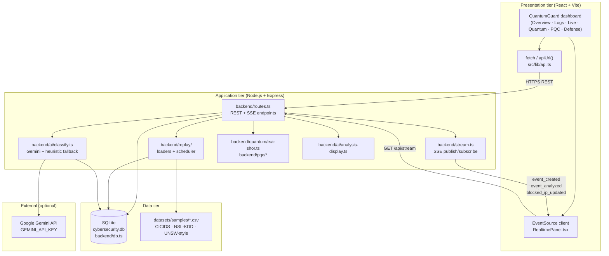
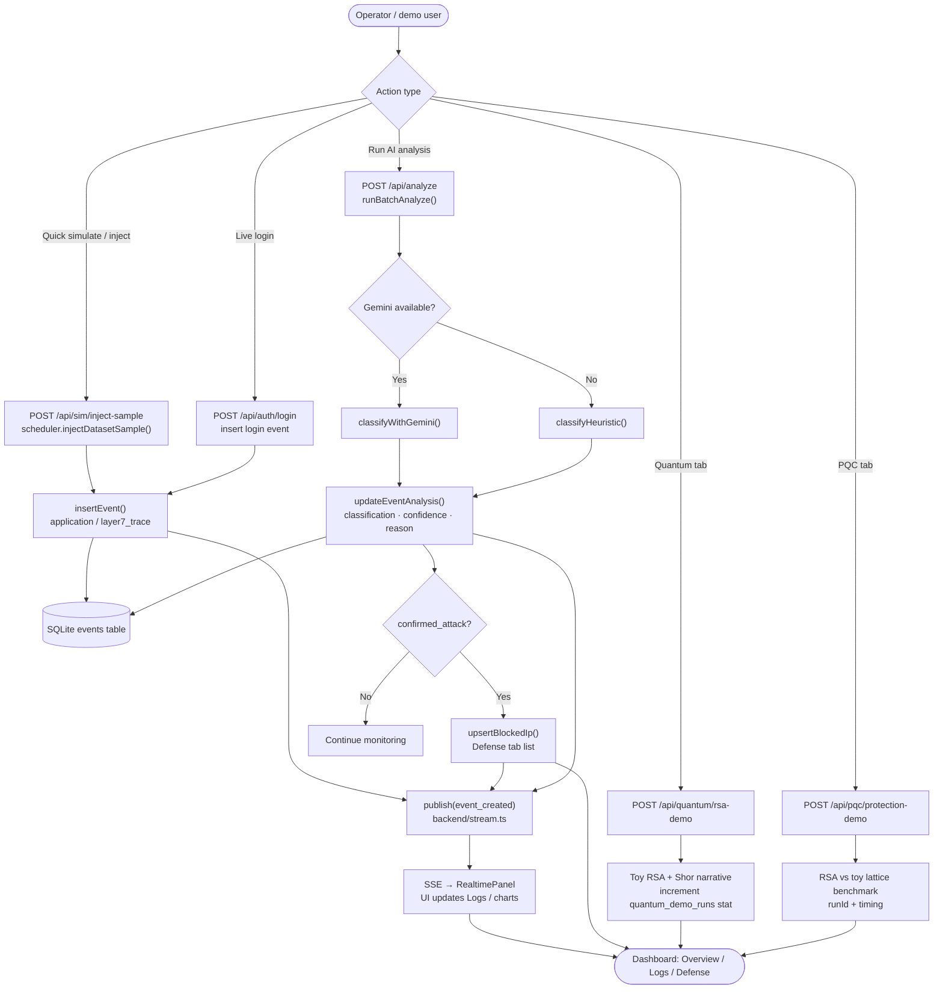
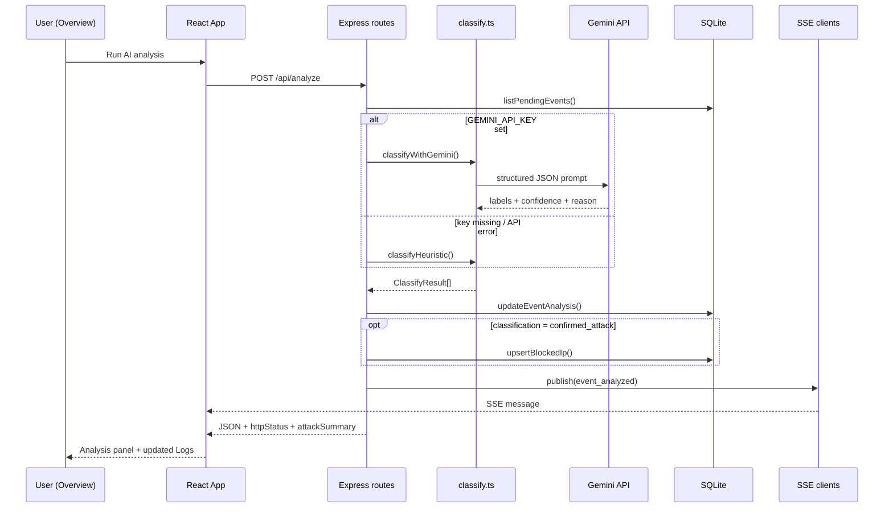
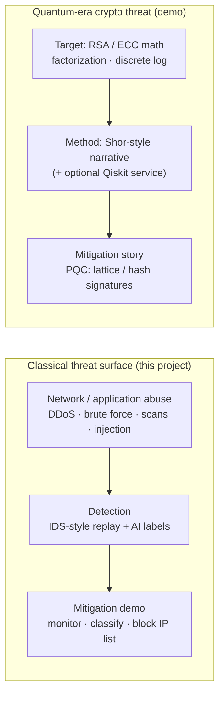
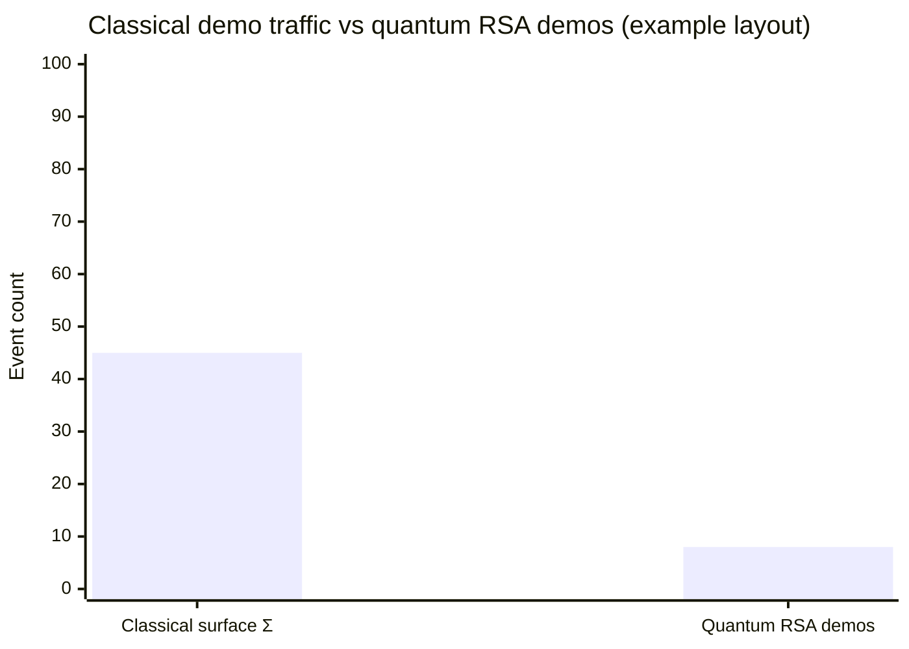
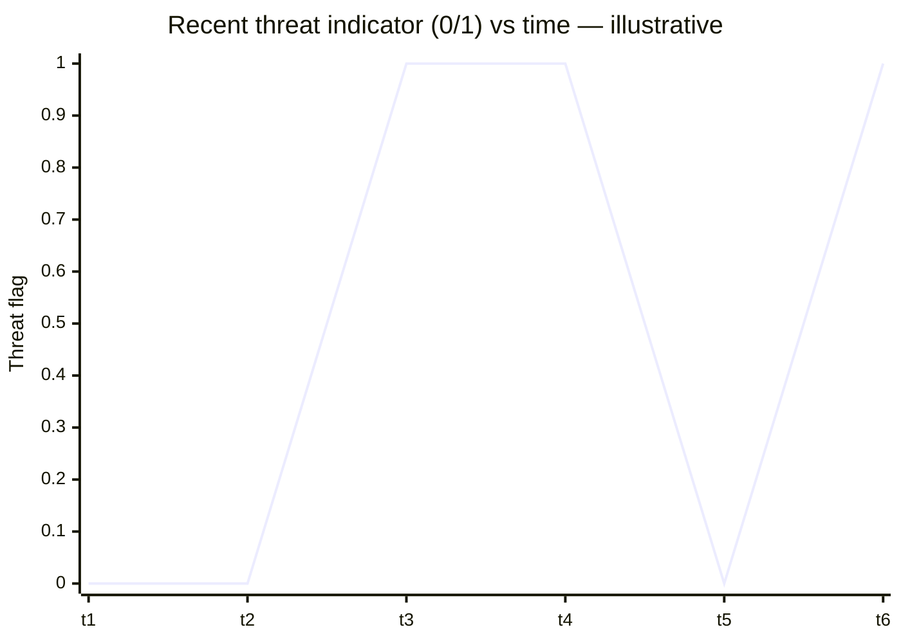
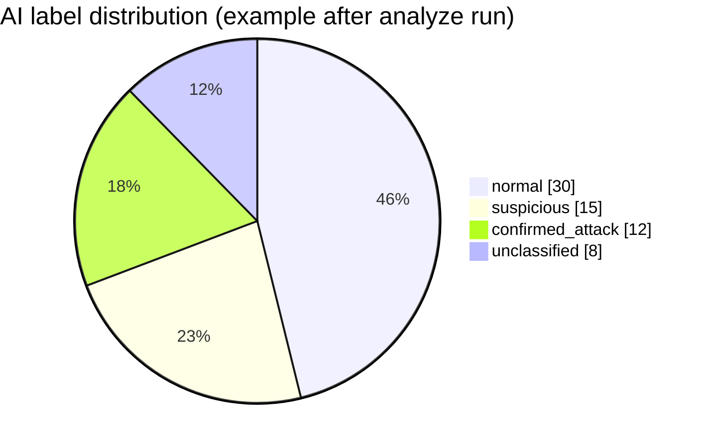
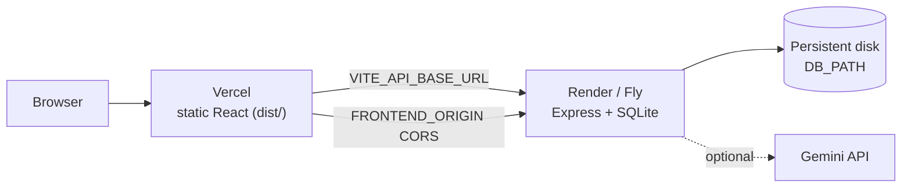

# Paper figures — QuantumGuard AI

Use these in your report/thesis. **Mermaid** blocks render on GitHub, many Markdown editors, and [mermaid.live](https://mermaid.live). Export PNG/SVG from mermaid.live for Word/LaTeX.

---

## Figure 1 — Proposed system architecture

Three-tier view: browser dashboard, API layer, persistence and external services. Matches Option 2 deployment (Vercel frontend + Render backend) or single-host dev.

**Caption (suggested):** *Proposed architecture of QuantumGuard AI: React dashboard communicates with Express via REST and Server-Sent Events; events persist in SQLite; optional Gemini classification; dataset samples feed replay/injection.*

---

## Figure 2 — End-to-end working flow (operational)

Main path from user action to visible outcome.

**Caption (suggested):** *Operational flow: events are ingested, stored, streamed to the UI, optionally classified; confirmed attacks trigger demo auto-block entries.*

---

## Figure 3 — Threat analysis sequence (AI path)

---

## Figure 4 — Classical vs quantum threat model (conceptual)

For Section 2 / Discussion — not a runtime diagram.

---

## Figure 5 — Evaluation / metrics graphs (what to plot)

These match data your system **actually produces**. Generate numbers from SQLite or screenshot the **Defense → Comparison** tab after running demos.

### 5a. Confusion matrix (classifier vs ground truth)

*Requires events with `ground_truth_label` and completed `classification`.*

|  | Pred. normal | Pred. suspicious | Pred. confirmed_attack |
|--|--------------|------------------|------------------------|
| **GT normal** | TN | FP₁ | FP₂ |
| **GT attack** | FN₁ | FN₂ | TP |

**Caption:** *Confusion matrix on replayed rows with ground-truth labels (define “positive” as confirmed_attack or suspicious∪confirmed_attack).*

### 5b. Bar chart — demo event volume (built into UI)

Replace `[45, 8]` with values from **`GET /api/stats`**: `classicalDemoTraffic`, `quantumVulnerabilityDemos`.

### 5c. Stacked breakdown — classical demo sources

```mermaid
xychart-beta
    title "Sources of classical demo events (example)"
    x-axis ["Count"]
    y-axis "Events" 0 --> 50
    bar "Replay/batch" [20]
    bar "Login monitor" [12]
    bar "Legacy synthetic" [3]
```

Map to: `datasetInjectedEvents`, `loginDemoEvents`, `simulatedAttackEvents`.

### 5d. Line chart — threat flags over time (Overview)

Conceptual; your Overview builds this from recent events:

**Implementation:** `App.tsx` maps last N events → `threats: 1` if `severity === 'high'` or `classification === 'confirmed_attack'`.

### 5e. Pie / bar — AI label distribution

After analysis, count rows by `classification`:

---

## Figure 6 — Deployment architecture (Option 2)

---

## How to cite in your paper

| Figure | Suggested label |
|--------|-----------------|
| Fig. 1 | Proposed three-tier architecture of QuantumGuard AI |
| Fig. 2 | End-to-end operational workflow from event ingestion to dashboard |
| Fig. 3 | Sequence of AI-assisted threat analysis and SSE notification |
| Fig. 4 | Classical intrusion monitoring vs quantum cryptographic threat model |
| Fig. 5 | Evaluation charts (confusion matrix + dashboard-derived counts) |
| Fig. 6 | Split deployment: Vercel frontend and Render backend |

---

## Quick checklist before submission

1. Run: inject scenarios → **Run AI analysis** → open **Defense** tab → export screenshots for Fig. 5.
2. Replace example numbers in xychart blocks with your **`/api/stats`** JSON.
3. Export Mermaid figures as PNG (300 dpi) from mermaid.live for Word/PDF.
4. Add one screenshot of **Logs** table showing `application` / `layer7_trace` and classification columns.
